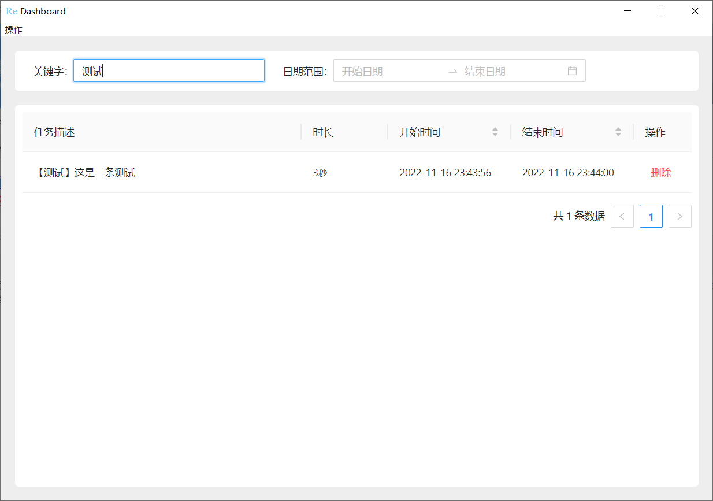

# Record Every Moment

## 简介
哈喽，我是 Chuanyang，这是一个**时间记录小工具**的项目。由于我本人经常使用电脑进行工作和学习，并且需要定期总结、汇报自己一段时间内的工作内容、时长以及进度（例如组会汇报一周的工作、Work from home 时自己一天实际工作了多长时间），因此非常想要一个工具能够只使用键盘进行操作，就可以**快速的记录自己正在干的事情、什么时候开始的、什么时候结束的以及花了多少时间**，以便于在需要的时候可以查看到自己的工作记录。如果你和我有一样的需求，不妨试一试这个工具吧。

## 功能介绍及使用教程
### 功能简介
1. 计时器

该工具一共包括三个部分，第一个部分是计时器，当选中计时器时，计时器呈现下图所示选中状态。可以通过开始、暂停、结束计时器来创建一个新任务记录，通过在输入框中输入文字来记录该任务的相关信息。


<!-- <div style="display: flex; justify-content: center;">
    <image src="./docs/pictures/recorder_extend.png" style="height: 100px"/>
</div> -->

当未选中计时器时，计时器可以置顶在屏幕最上方，高度透明放在屏幕的某一个角落，并且不会影响鼠标对该部分区域的操作，鼠标点击会穿透到下面的程序中。


<!-- <div style="display: flex; justify-content: center;">
    <image src="./docs/pictures/recorder_transparent.png" style="height: 100px;"/>
</div> -->

**所有对于计时器的操作都可以用快捷键进行而无需使用鼠标**

2. 数据面板

第二部分是数据面板，在数据面板上可以查到所有的任务记录，并可以通过时间和关键字进行筛选，通过时间进行排序。


<!-- <div style="display: flex; justify-content: center;">
    <image src="./docs/pictures/dashboard.png" style="height: 400px;"/>
</div> -->

3. 托盘

第三部分是托盘，可以通过托盘打开计时器和数据面板，或退出程序。


<!-- <div style="display: flex; justify-content: center;">
    <image src="./docs/pictures/tray.png" style="height: 60px;"/>
</div> -->

### 操作介绍
1. 计时器快捷键操作

- **Alt + X**：未选中状态  <==> 选中状态。快捷选中/不选中转换，该快捷键为全局快捷键，在使用其他程序的时候也有效，用于快速更改计时器状态。
- **Alt + C**：缩小 <==> 恢复。快捷缩小计时器，或者恢复并激活计时器，该快捷键也是全局快捷键。
- **Ctrl + D**：开始 <==> 暂停。快捷开始计时或暂停计时。该快捷键只有在计时器被激活（选中）时才有效。
- **Ctrl + F**：结束任务。该快捷键只有在计时器被激活（选中）时并且处于暂停状态才有效。

2. 托盘操作介绍

- 单击托盘：激活计时器
- 双击托盘：打开并激活数据面板
- 右键：打开菜单，里面有退出程序按钮

## 下载及安装介绍
### 下载链接
- windows 版：https://pan.baidu.com/s/1a0cUxajN6cOo7gDWSHA8RQ?pwd=9ade
- Linux 版：如有需要可联系我发布
- Mac 版：如有需要可联系我发布

### 安装教程
本软件为绿色软件，解压后即可使用，操作步骤如下：
- 将压缩包文件放在你所希望保存的位置
- 解压文件夹，并右键点击 ```REM.exe```，再点击```发送到```，再点击```桌面快捷方式```，这样桌面上就有一个快捷方式可以打开应用啦。


## 注意事项

- 目前该项目仅实现了最基础的记录和数据面板功能，后续将不断升级实现更好用的功能。
- 由于目前的实现较为简单，没有考虑后续升级程序的遍历性，估后续升级新版本时可能需要额外的手动操作来进行旧版本到新版本的数据迁移。

## 项目开发介绍
### 项目实现简介

由于我本人对前端开发比较熟悉，希望用我所熟悉的技术快速开发一个桌面应用，因此该项目技术栈如下：

- React：界面程序开发框架。
- Ant Design：界面 UI 组件库。
- Electron：基于 Chromium 和 Node.js 的跨平台桌面应用开发框架。
- Sqlite：本地数据库实现数据持久化。

### 项目启动

首先，克隆本项目并切换到项目根目录

```
// 从 gitee 上克隆项目
git clone https://gitee.com/g847714121/record-every-moment
// 或者从 github 上克隆项目
git clone https://github.com/ChuanyangGong/Record_every_moment.git
```

安装依赖（建议使用最新版的 node 和 npm，并切换到阿里源，否则在安装 electron forge 相关的东西时可能会报错）。

```
npm install
```

启动 react 界面服务（会自动跳出一个网页，关掉即可）

```
npm run start
```

再开一个终端（cmd）启动 electron

```
npm run electron-dev
```

### 项目打包发布

打包构建界面部分

```
npm run build
```

打包 electron 应用程序

```
npm make
```

在 ```out``` 文件夹里就会有打包发布的结果

### 项目关键文件介绍

- electron 与操作系统的交互操作写在 ```main.js``` 文件中
- 界面内容写在 ```src```中
  - 计时器在 ```src/pages/MiniRecorder``` 中
  - 数据面板在 ```src/pages/Dashboard``` 中

## 联系方式
Email: cy_gong@foxmail.com